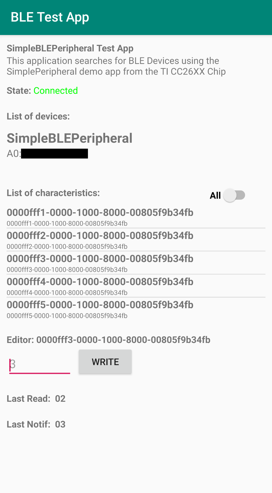

# BLE Test App
## SimpleBLEPeripheral Test App

This application searches for BLE Devices using the SimplePeripheral demo app from the TI CC26XX Chip
The source code of this application can be found [here](https://github.com/zekemyapp/Simple_Peripheral_CC26xx_CustomBoard)

## IMPORTANT
You are free to use this code if you will. But be aware that it was coded in a rush and it is not only full of bugs
but it has also more than a couple of null exceptions. Notably, **avoid clicking on any button if you are not connected
to a device and/or haven't clicked on a characteristic**.

I don't plan to support this app since a proper code made by the Android project already exist [here](https://developer.android.com/guide/topics/connectivity/bluetooth-le)

## Images

